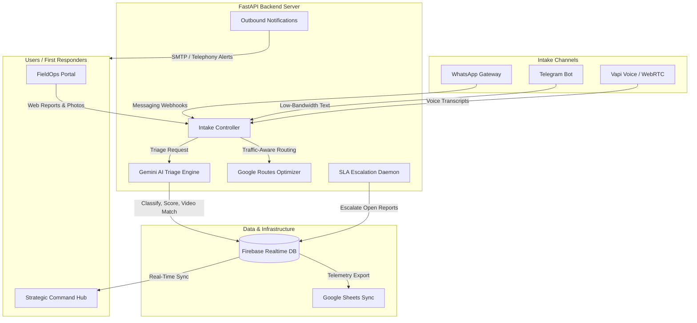

# CommunityPulse: Intelligent Field Coordination

**Live Deployment:** https://community-pluse.vercel.app/  
**Backend API Endpoint:** https://community-pulse-api.onrender.com

CommunityPulse is a real-time field coordination platform designed for rapid disaster response, tactical volunteer management, and emergency triage. Developed for the Google Solution Build / Google AI Hackathon, the project integrates Google Gemini AI model capabilities with decentralized client gateways to synchronize field operations and command center operations.

---

## Technical Architecture

The architecture consists of two main client portals communicating through a FastAPI gateway to a Firebase Realtime Database.



### Layer Details
- **Frontend Layer**: Built using Next.js 16 (Webpack), styled with Tailwind CSS, and using React-Leaflet for geospatial map rendering. Voice communications leverage the Vapi Web SDK.
- **Backend Layer**: Driven by a FastAPI (Python) server integrating the Google Gemini 2.0 Flash SDK (`google.genai`) and the Firebase Admin SDK.
- **Data Synchronicity**: Driven by the Firebase Realtime Database to achieve latency-free updates across portals.

---

## Core Capabilities

### Intake & Communication Gateways
- **WhatsApp Integration**: Ingests incoming WhatsApp messages via Meta Graph APIs, auto-replies with safety instructions, and syncs data to Firebase.
- **Telegram Bot Chat-Ops**: Ingests low-bandwidth Telegram reports and allows responders to use chat commands (`/accept`, `/resolve`) to update database states.
- **WebRTC Voice Agent**: Allows hands-free audio reporting in the browser with real-time AI transcription and location extraction.
- **Outbound Telephony (Vapi)**: Triggers automated phone alerts to volunteers for high-urgency (10/10) incidents.
- **SMTP Email Relay**: Automatically generates and emails secure login credentials to newly onboarded volunteers.

### AI Triage & Verification
- **Multimodal Vision Intake**: Analyzes field photos to verify hazards (e.g. fire, floods) and dynamically scales urgency scores.
- **Dynamic Headings & AI Backfill**: Generates concise incident titles at runtime. A background daemon sweeps the database to backfill missing titles for offline reports.
- **Heuristic Fallback Engine**: If Gemini API quotas are exhausted, local regex and keyword heuristics triage reports and assign urgency scores.
- **SLA Escalation Loop**: Automatically increases urgency (+2) and search radius (+5km) if an incident remains unassigned for over 5 minutes.
- **Emergency YouTube Guides**: Recommends targeted first-aid and survival guides (British Red Cross, St John Ambulance UK, American Heart Association) matching the incident category.

### Dispatch & Client Portals
- **Incident Clustering**: Deduplicates multiple reports from the same location (2km radius, 10-minute window) into a single major cluster.
- **Traffic-Aware Navigation**: Integrates Google Routes API to calculate traffic durations and renders route polylines on the volunteer map.
- **FieldOps Portal & Offline Cache**: Features a high-contrast reporting UI. Offline reports are stored locally in the client cache and synced when connection is restored.
- **Strategic Command Hub (Black Protocol)**: A secure portal for coordinate telemetry, volunteer filtering, real-time message logs, and command analytics.

---

## Security Hardening

- **Role-Based Auth**: Protected routes require a valid Firebase ID token as a Bearer token in headers. Authentication dependencies check user roles (ADMIN/VOLUNTEER) in the database.
- **Rate Limiting & Brute-Force Block**: Limits `/intake` requests to 60 requests/minute per IP, and `/auth/verify-code` to 10 requests/minute. Blocks brute-force IPs for 15 minutes after 5 consecutive failures.
- **HTTP Security Headers**: Configures HSTS, Content-Security-Policy (CSP), and X-Frame-Options (DENY). CSP configurations bypass checks specifically on `/docs`, `/redoc`, and `/openapi.json` to allow Swagger UI rendering.

---

## Local Development Setup

### 1. Configure Environments
Create a `.env` file in the frontend and backend directories based on the templates provided:

**Frontend (`frontend/.env`)**
```env
NEXT_PUBLIC_API_URL=http://localhost:8000
NEXT_PUBLIC_FIREBASE_API_KEY=your_firebase_key
NEXT_PUBLIC_VAPI_PUBLIC_KEY=your_vapi_key
```

**Backend (`backend/.env`)**
```env
GEMINI_API_KEY=your_gemini_key
FIREBASE_SERVICE_ACCOUNT_JSON=firebase-admin.json
CORS_ORIGINS=http://localhost:3000,https://community-pluse.vercel.app
```

### 2. Frontend Execution
```bash
cd frontend
npm install
npm run dev
```

### 3. Backend Execution
```bash
cd backend
python -m venv venv
# Windows
.\venv\Scripts\Activate
# POSIX
source venv/bin/activate
pip install -r requirements.txt
python main.py
```

---

## API Documentation & Health Checks

- **Interactive API Swagger UI**: Available at `http://localhost:8000/docs`.
- **Service Health Check**: Endpoint at `http://localhost:8000/health` reports status, database connectivity, and environmental contexts.

---

## Troubleshooting FAQ

**Q: Swagger UI (/docs) fails to load stylesheets or inline scripts.**  
**A:** Ensure the backend environment variables do not override the CSP skip rules. The server is configured to bypass strict CSP check logic on `/docs` and `/openapi.json`.

**Q: Local tests fail with ModuleNotFoundError.**  
**A:** Make sure you activate the Python virtual environment (`venv`) inside `backend/` and install dependencies via `pip install -r requirements.txt` before running `pytest`.
